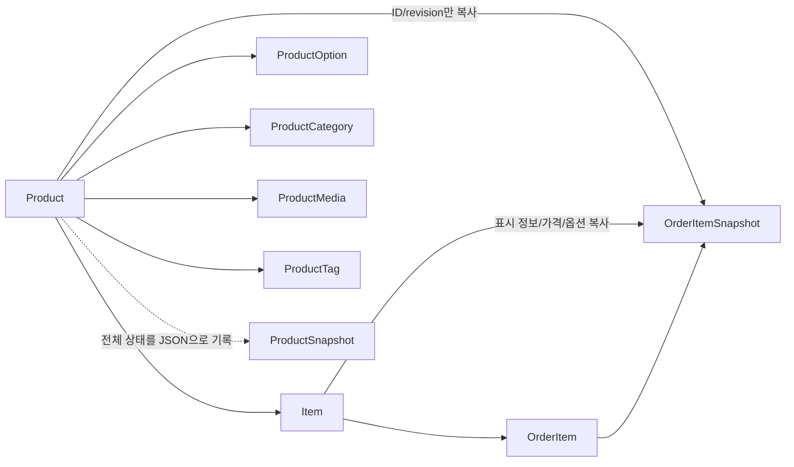

# Live Catalog, 변경 이력과 주문 Snapshot 설계

이 문서는 서로 다른 세 가지 상태를 구분합니다.

1. `Product`/`Item` graph는 현재 판매 상태의 권위 있는 모델입니다.
2. `ProductSnapshot`은 Product 변경 당시의 전체 상태를 JSON으로 남기는 append-only 감사 이력입니다.
3. `OrderItemSnapshot`은 주문 접수 시점의 상품과 가격을 복사한 거래 증거입니다.

`ProductSnapshot`과 `OrderItemSnapshot`은 이름에 Snapshot이 들어가지만 사용 목적과
생명주기가 다릅니다. 하나로 합치거나 서로 FK로 연결하지 않습니다.

상태 전이와 Entity/Service 책임은
[모델 경계 원칙](../architecture/model-boundaries.md)을 따릅니다.

## 1분 요약

| 모델                | 책임                                                  | 일반 조회/주문에서 사용    |
| ------------------- | ----------------------------------------------------- | -------------------------- |
| `Product`           | 현재 상품 정보, 운영 상태, `revision`                 | 사용                       |
| `Item`              | 현재 SKU, 표시명, 가격, 세금, 판매 상태, 재고         | 사용                       |
| Product 하위 관계   | 현재 옵션, 카테고리, 미디어, 태그                     | 사용                       |
| `ProductSnapshot`   | revision별 전체 판매 상태 JSON, 변경 유형/사유/행위자 | 사용 금지                  |
| `OrderItemSnapshot` | 주문 접수 시점의 표시 정보, 가격, 옵션                | 주문 저장/사후 증빙에 사용 |



점선은 실제 FK나 일반 조회 join이 아니라 변경 command가 남겨야 하는 감사 기록을
의미합니다. `OrderItemSnapshot` 안의 원천 ID/revision도 FK가 아닌 스칼라 증거입니다.

## 현재 구현과 계약

| 기능                                    | 현재 상태                                           |
| --------------------------------------- | --------------------------------------------------- |
| live `Query.product`                    | 구현, Product/Item/옵션/카테고리/태그 join          |
| live Item 기반 주문                     | 구현, Product/Item 잠금, 상태와 합산 재고 검증      |
| `OrderItemSnapshot` 생성                | 구현, 주문 aggregate와 같은 transaction에 저장      |
| `ProductSnapshot` Entity/payload 스키마 | 구현                                                |
| Product 작성/수정/삭제/복원 command     | 구현, Seller 소유권 또는 Admin 권한 검사            |
| Item/옵션/분류/태그 graph 변경 command  | 구현, 개별 Item과 전체 graph 교체 지원              |
| live 변경과 감사 Snapshot의 원자적 저장 | 구현, 검색 Outbox까지 같은 transaction에 저장       |
| 감사 이력 조회/복원 API                 | 구현, metadata 최신순 최대 100건과 새 revision 복원 |

Entity hook가 임의 변경의 이력을 자동 생성하는 구조는 아닙니다. 모든 Catalog 쓰기를
`ProductCommandService`로 통과시켜 아래 transaction 계약을 지킵니다. EntityManager로 live graph를
직접 수정하면 이 보장을 우회하므로 금지합니다.

현재 복원 command는 Product의 slug/이름/설명/반품 정책/상태, Item, 옵션, 카테고리와 태그를 과거 payload
값으로 되돌립니다.
Snapshot에 기록된 과거 media metadata는 감사용이며 복원 입력으로 적용하지 않습니다. 복원 시점의 live
media 연결은 그대로 보존됩니다. 카테고리는 과거 ID 연결만 다시 적용하며 공유 `Category`의 이름, slug와
상위 경로는 현재 값을 바꾸지 않습니다.

`productSnapshots` Query는 ID, revision, schema version, 변경 유형/사유/행위자/시각 metadata만
반환합니다. 내부 `payload`와 media `storageKey`는 GraphQL에 노출하지 않으며 `restoreProduct`가 선택한
revision을 서버 안에서 읽습니다.

## Live Catalog이 권위 있는 현재 상태다

`ProductEntity`는 현재 상품의 공통 정보를 갖습니다.

- 식별자, seller, slug
- 이름, 설명, 반품 정책
- `DRAFT`, `ACTIVE`, `PAUSED`, `SUSPENDED`, `CLOSED` 운영 상태
- 현재 상태의 버전인 `revision`
- Item, 옵션, 카테고리, 미디어, 태그 관계

`ItemEntity`는 현재 판매 단위입니다.

- SKU와 표시명
- 공급가, 부가세, 총액, 면세 여부
- 판매 허용 상태와 표시 순서
- 옵션 조합과 `optionSignature`
- 현재 재고 `stock`

따라서 일반 상품 조회와 주문 가격 판정은 다음 graph를 사용합니다.

```text
Product
  -> Items
     -> ItemOptionValues
        -> ProductOption / ProductOptionValue
  -> ProductOptions / ProductOptionValues
  -> ProductCategories / Category
  -> ProductMedia / MediaAsset
  -> ProductTags
```

`ProductSnapshot`을 join해 현재본을 찾거나, 가장 큰 revision을 읽어 현재 상태로
사용하지 않습니다. live table 자체가 현재본입니다.

## ProductSnapshot은 append-only 감사 이력이다

`ProductSnapshotEntity`는 정규화된 현재 상태를 대체하지 않습니다. Product의 한 revision을
사후에 설명하고 지원되는 필드를 복원할 수 있게 전체 graph를 JSON `payload`로 기록합니다.

| 필드                   | 의미                                    |
| ---------------------- | --------------------------------------- |
| `product_id`           | 이력의 소유 Product FK                  |
| `revision`             | 기록한 live Product revision            |
| `schema_version`       | JSON payload 형식 버전                  |
| `change_type`          | `CREATE`, `UPDATE`, `RESTORE`, `DELETE` |
| `payload`              | 변경 후 전체 Catalog 상태 JSON          |
| `reason`               | 선택적 변경 사유                        |
| `changed_by_member_id` | 변경 행위자                             |
| `created_at`           | 이력 생성 시각                          |

Product당 `(product_id, revision)`은 unique입니다. 과거 행을 UPDATE하거나 DELETE하지 않고
새로운 revision 행만 INSERT합니다. DB metadata가 UPDATE/DELETE를 물리적으로 차단하지는
않으므로, 모든 Catalog 쓰기를 전용 command Service로 제한해 이 정책을 보호합니다.

### Payload 범위

payload는 다음 판매 정보를 전체 상태로 보존합니다.

- Product의 seller, slug, 이름, 설명, 반품 정책, 운영 상태
- Item의 ID, SKU, 표시명, 가격, 세금, 판매 상태, 순서, 옵션 서명
- 옵션과 값, Item의 선택 옵션
- 카테고리와 당시 경로
- 미디어 metadata와 역할
- 태그

payload에는 `Item.stock`을 넣지 않습니다. 재고는 주문, 취소, 입고 등으로 빈번히
바뀌는 운영 상태이며 상품 편집 revision이 아닙니다. 현재 재고는 `Item.stock`, 변경 근거는
`InventoryMovement`가 권위를 가져야 합니다.

### Snapshot payload는 schema version을 갖는다

JSON 구조가 바뀌어도 과거 이력을 읽을 수 있어야 합니다. `schemaVersion`을 기준으로
파서와 복원기를 버전별로 구분합니다. 기존 payload를 제자리에서 대량 수정하지 않습니다.

## Revision과 Snapshot의 원자적 계약

Product 변경 한 번은 live graph와 감사 이력을 함께 바꾸는 하나의 command입니다.
성공한 변경 후에는 다음 조건이 모두 성립해야 합니다.

```text
Product.revision == 방금 삽입한 ProductSnapshot.revision
ProductSnapshot.payload == 방금 commit한 live Product graph에서 캡처한 전체 감사 상태
```

현재 변경 command는 writer transaction에서 다음 순서를 보장합니다.

1. Product를 잠그거나 기대 revision으로 동시 변경을 검증합니다.
2. 입력과 도메인 규칙을 검증하고 live Product/Item/하위 관계를 변경합니다.
3. `nextRevision = revisionBeforeChange + 1`을 계산해 `Product.revision`에 반영합니다.
4. 변경 후 live graph를 정규화된 JSON payload로 캡처합니다.
5. 같은 `nextRevision`으로 `ProductSnapshot` 한 행을 INSERT합니다.
6. live 변경과 Snapshot INSERT를 같은 transaction에서 commit합니다.

Snapshot INSERT가 실패하면 live 변경도 rollback해야 하고, live 변경이 실패하면 Snapshot도
남지 않아야 합니다. Snapshot을 queue나 별도 transaction으로 느슨하게 기록하면 감사
이력에 빈 revision이나 실제로 존재하지 않았던 상태가 남을 수 있습니다.

최초 Product 생성은 revision 1의 live graph와 revision 1 Snapshot을 같은 transaction에서 만듭니다.
이후 수정, 하위 graph 교체, soft delete와 복원은 pessimistic row lock과 `expectedRevision`으로 동시
변경을 막고 revision을 하나씩 증가시킵니다.

### 복원은 과거 revision을 재사용하지 않는다

revision 3을 revision 8 시점에 복원하더라도 `Product.revision`을 3으로 낮추지 않습니다.

```text
과거 revision 3 payload 선택
  -> live graph에 적용
  -> Product.revision = 9
  -> changeType RESTORE, revision 9 Snapshot 추가
```

이렇게 해야 변경 순서가 단조 증가하고 복원 행위 자체도 감사 이력에 남습니다.

현재 `restoreProduct`가 적용하는 범위는 Product의 slug/이름/설명/반품 정책/상태, Item, 옵션,
카테고리와 태그입니다. 과거 payload의 media metadata는 적용하지 않고 현재 live media 연결을
유지합니다. media 연결까지 되돌려야 한다면 별도 Catalog command와 소유권/파일 수명 규칙을 먼저
추가해야 합니다.

카테고리 복원도 Snapshot의 과거 ID를 Product에 다시 연결하는 범위입니다. 당시 이름, slug와 경로는
감사 payload에 남지만 공유 `Category` Entity 자체를 과거 값으로 되돌리지는 않습니다.

## 일반 조회와 주문에서 ProductSnapshot을 금지한다

`ProductSnapshot`을 일반 조회의 현재본으로 쓰면 다음 문제가 생깁니다.

- 정규화된 live 상태와 JSON 복제본 중 어느 것이 권위 있는지 다시 불분명해집니다.
- 일반 query가 JSON schema version과 이력 파서에 의존합니다.
- 주문이 감사 행에 FK로 묶여 이력 보존과 Catalog 운영이 서로 제한됩니다.
- 과거 이력 정리나 schema 변환이 온라인 주문의 가용성에 영향을 줍니다.

따라서 다음을 금지합니다.

- `Query.product`에서 `ProductSnapshot` 조회
- `OrderService`에서 `ProductSnapshot` 조회
- `ProductSnapshot`을 `OrderItem`/`OrderItemSnapshot`의 FK 원천으로 사용
- 가장 큰 Snapshot revision을 live revision으로 추측
- Snapshot payload를 MikroORM live Entity로 그대로 반환

Snapshot을 읽을 수 있는 기능은 감사 이력 조회, 지원 범위의 복원 command, 데이터 검증과 재구성
도구로 한정합니다.

## OrderItemSnapshot은 별도의 주문 증거다

`OrderItemSnapshotEntity`는 PENDING 주문을 접수할 때 live Product/Item에서 다음 값을
복사합니다.

- Product ID, Item ID, Product revision
- 상품명, Item 표시명, SKU
- 설명과 반품 정책
- 공급가, 부가세, 단위 총액, 면세 여부
- 선택 옵션의 코드와 당시 표시명

`sourceProductId`, `sourceItemId`, `sourceProductRevision`은 숫자 출처를 남기는 스칼라이며
`ProductSnapshot` FK가 아닙니다. 관련 Catalog 행이 나중에 바뀌거나 삭제되어도 주문
증거는 자체 값으로 완전해야 합니다.

```text
주문 시점 live Product revision 7
  Product.name: 기본 티셔츠
  Item.totalPrice: 12,000

OrderItemSnapshot
  sourceProductId: 1
  sourceItemId: 101
  sourceProductRevision: 7
  productName: 기본 티셔츠
  unitTotalPrice: 12,000
```

이후 live Product가 revision 8, 9로 변경되어도 주문 Snapshot은 revision 7의 주문
조건을 그대로 유지합니다. 영수증, 환불, 고객 문의는 live Catalog나 감사 Snapshot을 다시
조합하지 말고 `OrderItemSnapshot`을 사용해야 합니다.

현재 주문 입력은 `itemId`/`quantity`만 받으므로 화면에서 본 revision을 요청 계약으로
고정하지 않습니다. 처리 시점의 live 가격을 적용합니다. 가격 변경 재확인이 필요하면
예상 Product revision 또는 기대 가격을 input에 추가하는 별도 API 계약을 설계해야 합니다.

## DB와 애플리케이션의 보장 범위

### DB가 보장하는 것

| 규칙                                      | 수단                                            |
| ----------------------------------------- | ----------------------------------------------- |
| Product당 Snapshot revision 중복 금지     | `(product_id, revision)` unique                 |
| Snapshot의 Product/행위자 참조            | FK, 행위자는 nullable                           |
| Item/옵션/값 참조와 Item당 옵션 중복 방지 | 단일 FK와 `(item_id, product_option_id)` unique |
| Product 내 Item 순서/옵션 서명 중복 금지  | unique                                          |
| OrderItem당 주문 Snapshot 최대 하나       | `order_item_id` primary key                     |

DB만으로는 Snapshot append-only, payload와 live graph의 일치, revision의 원자적 증가,
가격 합계와 옵션 완전성을 자동으로 보장하지 않습니다.

### 애플리케이션이 보장해야 하는 것

| 규칙                                                 | 책임                              |
| ---------------------------------------------------- | --------------------------------- |
| Product 변경과 revision/Snapshot 삽입의 원자성       | `ProductCommandService`           |
| Snapshot append-only와 schemaVersion 해석            | Catalog command/이력 Service      |
| 복원 시 현재 media 연결 보존                         | Catalog command/writer            |
| payload에 stock 제외                                 | Snapshot projector/factory        |
| 가격 합계, 면세, required 옵션, optionSignature 검증 | Catalog writer/명령               |
| Item/옵션/값의 Product와 옵션 소속 일치              | Catalog writer/명령               |
| soft delete 행을 일반 조회에서 제외                  | Query/Command Service             |
| 주문 가능 Product/Item을 writer에서 조회             | `OrderService`                    |
| Product/Item 고정 순서 잠금, Item별 합산 검사와 차감 | `OrderService`/`InventoryService` |
| 주문 Snapshot 복사와 주문 aggregate 함께 저장        | Order rich Entity/transaction     |

## 스키마를 바꿀 때 판단 기준

새 필드를 추가할 때는 다음 순서로 묻습니다.

1. 현재 상품 조회/주문에 필요한가?
2. Product 편집 revision에 포함되어 과거 상태를 복원해야 하는가?
3. 주문 시점의 거래 증거로 별도 복사해야 하는가?
4. 재고처럼 Catalog 편집과 독립적으로 자주 바뀌는가?

적용 기준:

- 현재 판매 상태는 live Product/Item 하위 Entity에 저장합니다.
- 복원할 Catalog 판매 상태는 `ProductSnapshot.payload`에도 포함하고 command의 실제 복원 범위를 명시합니다.
- 주문 접수 조건은 `OrderItemSnapshot`에 복사합니다.
- 재고 현재값과 변경 원인은 `Item.stock`/`InventoryMovement`에 둡니다.

## 관련 파일

- [`product.entity.ts`](../../src/api/catalog/domain/entity/product.entity.ts): live Product와 revision
- [`item.entity.ts`](../../src/api/catalog/domain/entity/item.entity.ts): live Item 판매 정보와 재고
- [`product-snapshot.entity.ts`](../../src/api/catalog/domain/entity/product-snapshot.entity.ts): append-only 변경 이력 metadata
- [`product-snapshot-payload.ts`](../../src/api/catalog/domain/entity/product-snapshot-payload.ts): JSON payload 계약
- [`product.service.ts`](../../src/api/catalog/application/product.service.ts): live canonical Product 조회
- [`order.service.ts`](../../src/api/order/application/order.service.ts): live Item 검증, 재고 예약과 주문 저장
- [`product-command.service.ts`](../../src/api/catalog/application/product-command.service.ts): revision/Snapshot/Outbox 원자 저장
- [`product-snapshot.service.ts`](../../src/api/catalog/application/product-snapshot.service.ts): 권한이 적용된 이력 조회
- [`order-item-snapshot.entity.ts`](../../src/api/order/domain/entity/order-item-snapshot.entity.ts): 주문 시점 증거
- [`entities.ts`](../../src/infra/database/entities.ts): 전체 MikroORM Entity 등록 목록
