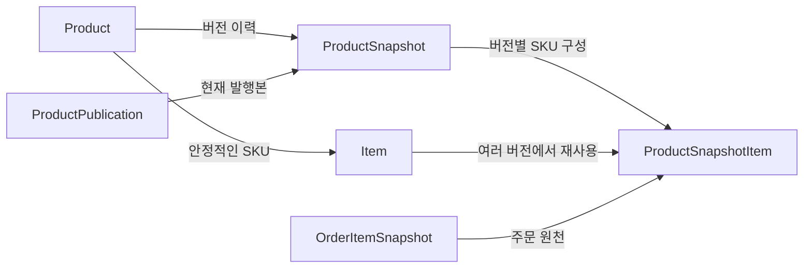
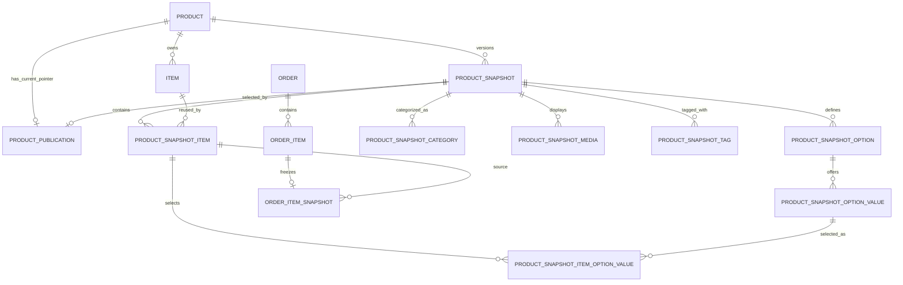

# 상품 변경 이력과 주문 Snapshot 설계

이 문서에서 스냅샷은 캐시나 변경된 필드의 목록이 아닙니다. 판매할 상품 상태 전체를 버전별로
보존하는 변경 이력입니다. DRAFT는 여러 번 편집할 수 있고, 새로운 판매 상태를 공개할 때 새 버전을
발행합니다.

## 1분 요약

> `Product`와 `Item`은 계속 유지되는 실체이고, `ProductSnapshot`은 고객에게 공개한 상품 버전이며,
> `ProductPublication`은 그중 현재 발행본을 가리키고, `OrderItemSnapshot`은 주문 접수 당시 값을
> 별도로 고정합니다.

| 모델                  | 책임                                           |
| --------------------- | ---------------------------------------------- |
| `Product`             | 안정적인 상품 ID, slug, 판매자, 운영 상태      |
| `Item`                | 실제 SKU와 현재 재고                           |
| `ProductSnapshot`     | 버전별 상품명, 설명, 반품 정책                 |
| `ProductSnapshotItem` | 해당 버전의 SKU 표시명, 가격, 세금, 판매 상태  |
| `ProductPublication`  | Product마다 현재 발행본 하나를 선택하는 포인터 |
| `OrderItemSnapshot`   | 주문 접수 시 실제 사용한 표시 정보, 단가, 옵션 |



현재 구현 범위도 먼저 구분해야 합니다.

| 기능                                  | 현재 상태                            |
| ------------------------------------- | ------------------------------------ |
| 현재 발행본 조회와 주문 Snapshot 생성 | v1, v2, v3 주문 경로에 구현          |
| 조건부 재고 차감                      | v1, v3에 구현                        |
| Item 행 잠금 후 재고 차감             | v2에 구현                            |
| DRAFT 작성, 복사, 발행 명령           | 아직 미구현                          |
| 재고 예약/원장, 결제, 배송            | 모델만 존재하며 주문 경로에는 미연결 |

외부 주문 API에는 v3 queue 흐름만 `Mutation.placeOrder`로 연결됩니다. v1과 v2는 Snapshot과 동시성 처리
방식을 비교하기 위한 application service이며 runtime module에는 등록되지 않습니다.

## 왜 나누는가

상품 정보는 서로 다른 속도로 변합니다.

| 변화 종류                  | 예시                           | 저장 위치              |
| -------------------------- | ------------------------------ | ---------------------- |
| 안정적인 식별 정보         | Product ID, 판매자, slug       | `Product`              |
| SKU 식별과 실시간 재고     | sku, 현재 stock                | `Item`                 |
| 판매자가 발행하는 카탈로그 | 이름, 설명, 가격, 옵션, 미디어 | `ProductSnapshot` 하위 |
| 주문 접수 당시 값          | 적용 가격, 옵션명, 반품 정책   | `OrderItemSnapshot`    |
| 재고 변화의 원인           | 입고, 예약, 판매, 반품         | `InventoryMovement`    |

모든 필드를 Product나 Item 한 행에 넣으면 수정할 때 과거 값이 사라집니다. 반대로 stock까지 상품
스냅샷에 넣으면 주문마다 상품 버전을 만들어야 합니다. 그래서 카탈로그 변경 이력과 실시간 재고를
분리합니다.

## 관계 지도



`ProductPublication`은 Snapshot 하나를 반드시 참조하지만, 대부분의 DRAFT와 과거 발행본에는 자신을
가리키는 Publication이 없습니다.

## 핵심 모델

### Product와 Item

`Product`는 상품의 정체성입니다. slug와 판매자는 생성 후 바꾸지 않는 서비스 규칙으로 취급합니다.
상품명이나 가격은 여기에 두지 않습니다.

`Item`은 주문 요청의 `itemId`가 가리키는 실제 재고 단위입니다. 일반적인 커머스 용어로 SKU 또는
Variant에 가깝습니다.

```text
Product: 기본 티셔츠
  Item #101: 검정/M, stock 20
  Item #102: 검정/L, stock 15
```

정확히는 `Item`에 옵션 표시명은 없습니다. Item은 불변 sku 문자열과 현재 stock을 갖고,
`ProductSnapshotItem.name`이 버전별 SKU 표시명을 갖습니다. 같은 Item은 Snapshot v1, v2, v3에서
계속 재사용됩니다.

### ProductSnapshot과 ProductSnapshotItem

`ProductSnapshot`은 한 상품 버전의 공통 정보를 보존합니다.

- 상품명
- 설명
- 반품 정책
- 해당 버전의 옵션, 카테고리, 미디어, 태그

`ProductSnapshotItem`은 그 버전에서 Item이 어떻게 판매됐는지 보존합니다.

- SKU 표시명과 당시 sku 문자열
- 공급가, 부가세, 단위 총액
- 면세 여부와 판매 허용 상태
- 표시 순서와 옵션 조합 서명

가격의 source of truth는 `ProductSnapshotItem` 하나입니다. Item에는 가격이 없습니다. 현재 가격은
Publication이 가리키는 현재 발행본의 SnapshotItem에서 읽습니다.

Snapshot 상태는 두 개입니다.

- `DRAFT`: 작성 중이며 편집할 수 있음
- `PUBLISHED`: 발행된 변경 이력이며 이후 수정하거나 삭제하지 않아야 함

여러 PUBLISHED 버전이 존재할 수 있습니다. 현재 발행본은 가장 큰 version이나 상태로 추측하지 않고
반드시 `ProductPublication`으로 찾습니다.

### ProductPublication

`ProductPublication`은 Product마다 최대 하나 존재하는 현재 발행본 포인터입니다.

```text
Product #1
  ProductSnapshot v1: PUBLISHED
  ProductSnapshot v2: PUBLISHED <- ProductPublication
```

롤백도 과거 Snapshot을 수정하지 않고 포인터를 v1으로 옮기는 방식입니다. `publishedAt`은 포인터를
교체할 때 서비스가 명시적으로 갱신해야 합니다. Prisma 필드의 `@default(now())`는 최초 생성 시각만
자동으로 채웁니다.

`ProductPublication`과 `Product.status`는 다른 축입니다.

- Publication은 어떤 콘텐츠 버전을 현재본으로 사용할지 결정합니다.
- Product.status는 주문 가능한 운영 상태인지 결정합니다.

상품을 일시 중지해도 Publication은 유지할 수 있습니다. 현재 주문 코드는 Product가 `ACTIVE`인지와
현재 Publication이 유효한지를 각각 검사합니다.

현재 Publication을 OpenSearch 검색 read model로 투영하는 경계와 구현 순서는
[OpenSearch GraphQL 상품 검색 구현 계획](../search/opensearch-product-search.md)을 참고합니다.

### OrderItemSnapshot

`OrderItemSnapshot`은 PENDING 주문을 접수할 때 `OrderItem`과 함께 생성됩니다. 현재 구현은
ProductSnapshotItem 가격을 그대로 복사하며 할인 계산은 없습니다.

복사하는 값:

- 원천 ProductSnapshot과 Item ID
- 상품명, SKU 표시명, sku 문자열
- 상품 설명과 반품 정책
- 공급가, 부가세, 단위 총액, 면세 여부
- 선택 옵션의 코드와 표시명

```json
[
    {
        "optionCode": "color",
        "optionName": "색상",
        "valueCode": "black",
        "valueName": "검정"
    }
]
```

현재는 주문 Snapshot을 읽는 영수증이나 환불 API가 없습니다. 그런 기능을 추가할 때 현재 상품을 다시
조합하지 않고 이 값을 사용해야 과거 주문을 재현할 수 있습니다. 할인 기능을 추가한다면 원천 가격과
실제 주문 가격이 달라진 근거도 별도로 모델링해야 합니다.

## 변경, 발행, 주문 예시

### 최초 발행

```text
Product #1
  slug: basic-tshirt

Item #101
  sku: 019c...
  stock: 30

ProductSnapshot #1001, version 1, PUBLISHED
  name: 기본 티셔츠
  description: 매일 입는 면 티셔츠

ProductSnapshotItem (#1001, #101)
  name: 검정 / L
  totalPrice: 11,000
  itemSaleStatus: ALLOW

ProductPublication -> ProductSnapshot #1001
```

### 가격과 상품명 변경

v1을 UPDATE하지 않습니다. 현재 발행본 전체를 v2 DRAFT로 복사한 뒤 변경합니다. 새 스냅샷은 다른
버전과 합치지 않아도 그 시점의 판매 상태를 전부 읽을 수 있어야 합니다.

```text
ProductSnapshot #1001, v1, PUBLISHED
  name: 기본 티셔츠
  ProductSnapshotItem #101 totalPrice: 11,000

ProductSnapshot #1002, v2, DRAFT
  name: 프리미엄 기본 티셔츠
  ProductSnapshotItem #101 totalPrice: 12,000
```

발행 서비스는 한 primary 트랜잭션에서 다음을 수행해야 합니다. 이 서비스는 아직 구현되지 않았습니다.

1. Product와 Publication을 잠급니다.
2. Snapshot의 구성, 가격, 옵션을 검증합니다.
3. v2를 PUBLISHED로 바꾸고 최초 발행 시각을 기록합니다.
4. Publication 포인터를 v2로 바꾸고 `publishedAt`을 갱신합니다.

Product를 자동으로 ACTIVE로 바꾸지는 않습니다. 운영 상태 전이는 별도 정책으로 처리합니다.

### 주문 접수

Item #101을 2개 주문하면 처리 시점의 현재 발행본에서 가격 12,000원을 읽습니다.

```text
OrderItem
  itemId: 101
  quantity: 2
  lineTotalPrice: 24,000

OrderItemSnapshot
  sourceProductSnapshotId: 1002
  sourceItemId: 101
  productName: 프리미엄 기본 티셔츠
  itemName: 검정 / L
  unitTotalPrice: 12,000
```

이후 상품 스냅샷 version 3에서 가격이 13,000원이 되어도 이 주문 Snapshot은 12,000원으로 남습니다.

현재 요청은 itemId와 quantity만 전달하므로 고객이 화면에서 본 Snapshot이나 가격을 고정하지 않습니다.
주문 코드는 처리 시점의 권위 있는 현재 발행본을 primary에서 읽습니다. 화면에서 본 가격과 반드시 같게
하려면 요청에 예상 Snapshot ID 또는 가격을 추가하고, 달라졌을 때 재확인을 요구하는 계약이 필요합니다.

## 옵션, 카테고리, 미디어

### 옵션

옵션 이름과 값도 변경 이력의 일부이므로 Snapshot 아래에 있습니다.

```text
ProductSnapshotOption: 색상
  ProductSnapshotOptionValue: 검정
  ProductSnapshotOptionValue: 흰색

ProductSnapshotItem: 검정 / L
  ProductSnapshotItemOptionValue -> 색상: 검정
  ProductSnapshotItemOptionValue -> 사이즈: L
```

복합 FK는 다른 Snapshot의 옵션이나 다른 옵션에 속한 값을 연결하는 오류를 막습니다. DB는 저장된
`optionSignature` 문자열의 중복만 막습니다. 서명이 실제 옵션 선택과 일치하는지와 required 옵션이
모두 선택됐는지는 발행 서비스가 검사해야 합니다.

### 카테고리

`ProductSnapshotCategory`는 원본 Category ID와 다음 복사 컬럼을 가집니다.

```text
categoryName: 반팔 티셔츠
categorySlug: short-sleeve
categoryPath:
  - { id: "10", name: "의류", slug: "clothing" }
  - { id: "11", name: "상의", slug: "tops" }
  - { id: "12", name: "반팔 티셔츠", slug: "short-sleeve" }
```

현재 Category 트리가 바뀌어도 과거 Snapshot은 복사된 경로를 사용합니다. MySQL은 nullable unique에서
NULL을 서로 다른 값으로 취급하므로 `@@unique([parentId, name])`은 루트 Category 이름 중복을 완전히
막지 못합니다. 전역 slug unique는 루트에도 적용됩니다.

### 미디어

`ProductSnapshotMedia`는 당시 역할, 대체 텍스트, 표시 순서를 보존합니다. `MediaAsset`은 생성 후
파일과 메타데이터를 바꾸지 않는 서비스 규칙을 사용합니다. 파일이 바뀌면 새 asset을 만들고 새
Snapshot에 연결합니다.

## DB가 보장하는 것

| 규칙                                                      | 수단                                |
| --------------------------------------------------------- | ----------------------------------- |
| Product 안에서 version이 중복되지 않음                    | `@@unique([productId, version])`    |
| Product마다 Publication이 최대 하나                       | `ProductPublication.productId @id`  |
| Publication이 같은 Product의 Snapshot을 가리킴            | 복합 FK                             |
| SnapshotItem의 Snapshot과 Item이 같은 Product 소속        | 두 복합 FK                          |
| 같은 Snapshot에서 Item, 순서, 서명 문자열이 중복되지 않음 | PK와 unique                         |
| 옵션 값이 올바른 옵션과 같은 Snapshot에 연결됨            | 옵션 선택의 복합 FK                 |
| OrderItem당 주문 Snapshot이 최대 하나                     | `OrderItemSnapshot.orderItemId @id` |
| 주문 Snapshot의 원천 SnapshotItem이 실제로 존재함         | 복합 FK                             |
| SnapshotItem이나 주문이 참조하는 Item의 hard delete 제한  | `onDelete: Restrict`                |

DB 제약은 최소 하나의 하위 행 존재, 상태 전이, 금액 합계, 발행 후 불변성을 보장하지 않습니다.

## 서비스가 보장해야 하는 것

| 규칙                                                   | 책임                        |
| ------------------------------------------------------ | --------------------------- |
| Product.slug/sellerId, Item.sku/productId 불변         | 상품 명령 서비스            |
| 발행된 Snapshot과 모든 하위 행 수정/삭제 금지          | 상품 명령 서비스            |
| Publication은 PUBLISHED Snapshot만 참조                | 발행 트랜잭션               |
| `firstPublishedAt`, `publishedAt` 정확히 기록          | 발행 트랜잭션               |
| `totalPrice = supplyPrice + vat`, 면세 VAT 0           | 발행 검증                   |
| required 옵션 완전성과 optionSignature 일치            | 발행 검증                   |
| SnapshotItem.itemSku가 Item.sku와 일치                 | Snapshot 작성 서비스        |
| 카테고리 복사 컬럼과 categoryPath 형식이 원본과 일치   | Snapshot 작성 서비스        |
| MediaAsset 생성 후 불변                                | 미디어 명령 서비스          |
| soft delete 행을 일반 조회에서 제외                    | 모든 조회 서비스            |
| 수량이 양수                                            | 요청 검증과 주문 서비스     |
| 주문 원천이 처리 시점의 현재 Publication               | 주문 조회 조건              |
| 주문 Snapshot 복사 필드가 원천과 일치                  | 공용 `toOrderedItem` 변환기 |
| OrderItem.itemId와 주문 Snapshot의 sourceItemId가 일치 | 공용 주문 생성기            |
| 모든 OrderItem에 주문 Snapshot을 함께 생성             | 주문 트랜잭션               |
| lineTotalPrice와 Order.totalPrice가 품목 합계와 일치   | 주문 트랜잭션               |
| stock이 음수가 되지 않음                               | 행 잠금 또는 조건부 차감    |

스키마의 “불변”, “추가 전용” 주석은 DB가 UPDATE를 자동 차단한다는 뜻이 아닙니다. 현재 Prisma Client는
UPDATE와 DELETE를 수행할 수 있으므로 쓰기 경로가 정책을 강제해야 합니다. `deletedAt`도 자동 필터가
아니므로 조회 조건에 `deletedAt: null`을 명시해야 합니다.

`OrderItem.snapshot`과 `OrderItem.InventoryReservation`은 FK가 반대쪽에 있어 Prisma 스키마상 선택
관계입니다. DB가 보장하는 것은 각각 최대 하나라는 사실뿐입니다. 현재 주문 코드는 주문 Snapshot을
항상 함께 만들지만 InventoryReservation은 생성하지 않습니다.

## 스키마를 수정할 때 판단 기준

새 필드를 추가하기 전에 물어봅니다.

1. 상품 수명 동안 변하지 않는가?
2. 고객에게 노출되며 과거 버전을 복원해야 하는가?
3. 주문 접수 당시 값을 별도로 보존해야 하는가?
4. 재고처럼 카탈로그 편집과 독립적으로 자주 변하는가?

저장 위치:

- 안정 식별 정보는 Product 또는 Item
- 발행되는 판매 정보는 ProductSnapshot 하위
- 주문 접수 당시 값은 OrderItemSnapshot
- 재고 현재값과 변경 원인은 Item.stock과 InventoryMovement

## 관련 파일

- [`catalog.prisma`](../../prisma/models/catalog.prisma): Product, Category, MediaAsset
- [`item.prisma`](../../prisma/models/item.prisma): Item
- [`catalog-snapshot.prisma`](../../prisma/models/catalog-snapshot.prisma): Snapshot, Publication, SnapshotItem
- [`catalog-option.prisma`](../../prisma/models/catalog-option.prisma): Snapshot 옵션
- [`order.prisma`](../../prisma/models/order.prisma): OrderItem과 OrderItemSnapshot
- [`inventory.prisma`](../../prisma/models/inventory.prisma): 재고 예약과 원장
- [`ordered-item.ts`](../../src/api/order/domain/ordered-item.ts): 주문 Snapshot 공용 변환
