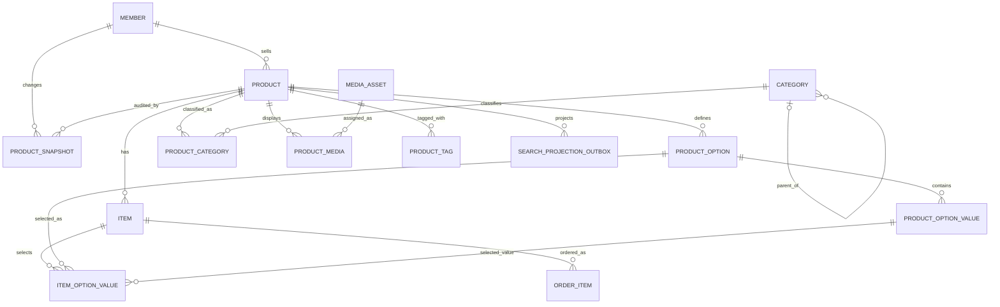
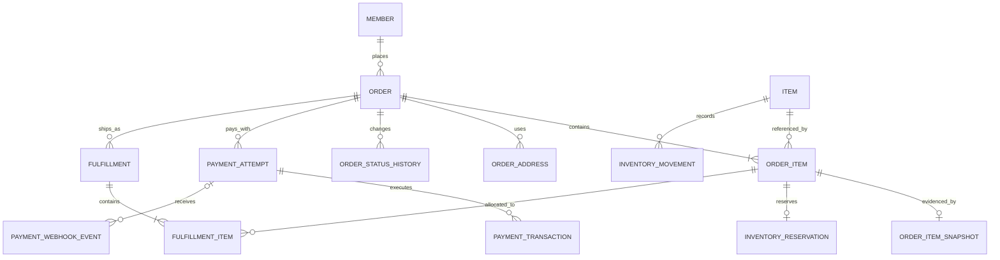

# 데이터베이스 스키마 안내서

상태: 현재 MikroORM metadata 기준 정본

이 문서는 현재 등록된 25개 MikroORM 모델을 도메인 관점에서 읽기 위한 스키마 안내서입니다.
컬럼 타입, 외래 키, unique/index의 실행 가능한 정본은
[`databaseEntities`](../../src/infra/database/entities.ts)와 각 Entity source입니다. 이 문서는 그 구조가
왜 존재하고, 어느 상태를 권위 있게 다루며, 구현이 어디까지 완료됐는지를 설명합니다.

현재 MySQL column에 별도 `COMMENT`를 생성하지 않습니다. 따라서 DB 도구에서 보이는 물리 schema만으로
의미를 추측하지 말고, 이 문서와 Entity source를 함께 확인합니다.

## 먼저 구분할 세 가지 상태

이 프로젝트에는 이름이 비슷하지만 책임이 전혀 다른 세 가지 상태가 있습니다.

| 상태                            | 권위와 용도                                               | 대표 모델                                    |
| ------------------------------- | --------------------------------------------------------- | -------------------------------------------- |
| 현재 상태, live current state   | 지금 조회하고 주문할 수 있는 상품, 재고와 거래 진행 상태  | `ProductEntity`, `ItemEntity`, `OrderEntity` |
| 변경 이력, append-only audit    | 상품 변경 당시 전체 상태와 변경 이유를 revision별로 보존  | `ProductSnapshotEntity`                      |
| 거래 증거, transaction evidence | 주문 접수 당시 이름, 가격, 세금과 선택 옵션을 그대로 보존 | `OrderItemSnapshotEntity`                    |

일반 상품 조회와 주문 가능 여부는 live `Product`/`Item` graph만 봅니다. `ProductSnapshot`의 최신 행을
현재 상품처럼 사용하지 않습니다. 주문이 생성되면 `OrderItemSnapshot`이 당시 조건을 독립적으로 복사하므로,
이후 상품이 변경되어도 과거 주문의 증거는 바뀌지 않습니다.

```text
현재 판매 상태 변경
  -> live Product/Item graph 갱신
  -> Product.revision 증가
  -> 같은 transaction에서 ProductSnapshot INSERT

주문 접수
  -> live Product/Item 식별
  -> Product/Item 고정 순서 잠금과 판매 상태 검증
  -> Item별 요청 수량 합산 검사와 예약 차감
  -> Order/OrderItem 생성
  -> OrderItemSnapshot에 주문 시점 값 복사
  -> InventoryReservation/Movement 저장
```

두 흐름 모두 구현되어 있습니다. Catalog command는 검색 Outbox까지 같은 transaction에 저장하며, 주문의
재고 예약은 결제 매입 시 소비되고 취소/만료 시 재고와 원장을 함께 복구합니다.

## 모델 이름과 계층 경계

현재 class 이름의 `Entity` 접미사는 MikroORM에 등록되는 모델이라는 기술적 명명일 뿐입니다. 별도의
순수 domain class를 같은 구조로 한 번 더 만들지 않으므로, aggregate로 모델링할 가치가 있는 경우 이
class가 도메인 모델과 persistence 모델을 함께 담당합니다. 예를 들어 `OrderEntity.place`와
`OrderItemEntity.create`는 생성 규칙과 금액 계산을 스스로 보호합니다.

반면 GraphQL `ObjectType`/`InputType`은 외부 API 계약이므로 Entity와 분리합니다. GraphQL의 문자열 ID,
공개 필드, nullability와 응답 구조가 DB column 구조에 직접 결합되지 않게 하기 위해서입니다.

```text
GraphQL Type != domain/persistence model
domain model == MikroORM Entity, 같은 aggregate를 표현하는 경우
```

`Entity` 접미사를 제거하는 리네이밍은 가능한 후속 정리지만, 현재 class가 persistence 전용 모델이라는
뜻은 아닙니다. 자세한 판단 기준은
[GraphQL, Entity와 도메인 모델 경계](../architecture/model-boundaries.md)를 따릅니다.

## 전체 테이블 사전

### 1. Member

| 모델, 테이블                                                              | 역할                                                                                                                    | 상태와 생명주기                                                                                 |
| ------------------------------------------------------------------------- | ----------------------------------------------------------------------------------------------------------------------- | ----------------------------------------------------------------------------------------------- |
| [`MemberEntity`](../../src/api/member/domain/member.entity.ts), `members` | 인증 주체, 판매자와 구매자의 공통 계정. email은 unique이고 비밀번호 hash, 전화번호, 최근 로그인/가입 시각을 보존합니다. | `role`: `GUEST`, `CUSTOMER`, `SELLER`, `ADMIN`. `deleted_at`을 사용하는 soft delete 모델입니다. |

Member는 판매 상품과 주문의 소유자를 연결합니다. 상품 변경 이력의 `changed_by_member_id`도 선택적으로
Member를 참조합니다. Catalog command가 실제 변경 행위자를 기록합니다.

### 2. Catalog

Catalog의 11개 테이블 중 10개는 현재 판매 상태이고, `product_snapshots`만 감사 이력입니다.

| 모델, 테이블                                                                                                              | 역할                                                                                          | 상태와 생명주기                                                                                                                              |
| ------------------------------------------------------------------------------------------------------------------------- | --------------------------------------------------------------------------------------------- | -------------------------------------------------------------------------------------------------------------------------------------------- |
| [`ProductEntity`](../../src/api/catalog/domain/entity/product.entity.ts), `products`                                      | 상품 공통 정보, seller, slug, 이름, 설명, 반품 정책과 현재 revision의 root입니다.             | `DRAFT`, `ACTIVE`, `PAUSED`, `SUSPENDED`, `CLOSED`. `deleted_at` soft delete를 사용합니다. 공개 조회와 주문은 `ACTIVE`만 허용합니다.         |
| [`ItemEntity`](../../src/api/catalog/domain/entity/item.entity.ts), `items`                                               | 실제 주문 가능한 SKU 단위입니다. 가격, 세금, 현재 재고, 옵션 조합과 표시 순서를 가집니다.     | `ALLOW`, `DENY`. `deleted_at` soft delete를 사용합니다. 주문은 `ALLOW`이고 삭제되지 않은 Item만 허용합니다.                                  |
| [`ProductOptionEntity`](../../src/api/catalog/domain/entity/product-option.entity.ts), `product_options`                  | 상품의 옵션 축입니다. 예: 색상, 사이즈. `code`, 표시명, 필수 여부와 순서를 가집니다.          | Product에 종속된 현재 상태입니다. Product 안에서 code/name/sequence가 각각 unique입니다.                                                     |
| [`ProductOptionValueEntity`](../../src/api/catalog/domain/entity/product-option-value.entity.ts), `product_option_values` | 옵션 축에서 선택할 값입니다. 예: 색상의 빨강, 사이즈의 M.                                     | ProductOption에 종속됩니다. 한 옵션 안에서 code/name/sequence가 각각 unique입니다.                                                           |
| [`ItemOptionValueEntity`](../../src/api/catalog/domain/entity/item-option-value.entity.ts), `item_option_values`          | Item이 실제로 선택한 옵션 값의 연결입니다.                                                    | surrogate `BIGINT` PK, 단일 Item/옵션/값 FK와 `(item_id, product_option_id)` unique를 사용합니다. `product_id`는 검증용 scalar입니다.        |
| [`CategoryEntity`](../../src/api/catalog/domain/entity/category.entity.ts), `categories`                                  | 자기 참조 트리 형태의 분류입니다. slug는 전역 unique이고 `(parent, name)` 제약을 둡니다.      | `is_active`와 `deleted_at`을 함께 가집니다. parent 삭제는 restrict입니다.                                                                    |
| [`ProductCategoryEntity`](../../src/api/catalog/domain/entity/product-category.entity.ts), `product_categories`           | 현재 상품과 카테고리의 다대다 연결, 상품 내 표시 순서를 가집니다.                             | `(product_id, category_id)`가 PK이고 Product 안에서 sequence가 unique입니다.                                                                 |
| [`MediaAssetEntity`](../../src/api/catalog/domain/entity/media-asset.entity.ts), `media_assets`                           | 저장소 key, MIME, byte 크기, checksum과 이미지 크기를 가진 재사용 가능한 파일 metadata입니다. | `storage_key`가 unique입니다. 파일 자체의 저장과 URL 발급은 이 모델의 책임이 아닙니다.                                                       |
| [`ProductMediaEntity`](../../src/api/catalog/domain/entity/product-media.entity.ts), `product_media`                      | 현재 상품에 MediaAsset을 배치하고 역할, 대체 텍스트와 순서를 부여합니다.                      | 역할은 `THUMBNAIL`, `GALLERY`, `DETAIL`, `ATTACHMENT`입니다. 상품 내 `(role, sequence)`와 `(asset, role)` 중복을 막습니다.                   |
| [`ProductTagEntity`](../../src/api/catalog/domain/entity/product-tag.entity.ts), `product_tags`                           | 현재 상품의 정렬 가능한 짧은 태그입니다.                                                      | `(product_id, value)`가 PK이고 Product 안에서 sequence가 unique입니다.                                                                       |
| [`ProductSnapshotEntity`](../../src/api/catalog/domain/entity/product-snapshot.entity.ts), `product_snapshots`            | 상품 변경 후 전체 Catalog 상태를 JSON payload와 metadata로 남기는 감사 기록입니다.            | `CREATE`, `UPDATE`, `RESTORE`, `DELETE`. Product당 revision이 unique이며 정책상 append-only입니다. 일반 조회와 주문에서는 사용하지 않습니다. |

### 3. Order

| 모델, 테이블                                                                                                             | 역할                                                                        | 상태와 생명주기                                                                                     |
| ------------------------------------------------------------------------------------------------------------------------ | --------------------------------------------------------------------------- | --------------------------------------------------------------------------------------------------- |
| [`OrderEntity`](../../src/api/order/domain/entity/order.entity.ts), `orders`                                             | 구매자, 주문번호, 상태, 통화와 주문 합계를 가진 주문 aggregate root입니다.  | `PENDING`, `CONFIRMED`, `CANCELLED`, `COMPLETED`. 회원별 멱등성 키와 요청 fingerprint를 보존합니다. |
| [`OrderItemEntity`](../../src/api/order/domain/entity/order-item.entity.ts), `order_items`                               | 주문에 포함된 live Item 참조, 수량과 line 합계를 가집니다.                  | Order 생성과 함께 저장됩니다. Catalog 참조는 유지하되 거래 표시 값은 별도 Snapshot에 복사합니다.    |
| [`OrderItemSnapshotEntity`](../../src/api/order/domain/entity/order-item-snapshot.entity.ts), `order_item_snapshots`     | 주문 당시 상품명, SKU, 설명, 반품 정책, 단가/세금과 선택 옵션을 보존합니다. | `order_item_id`가 PK인 1:1 증거입니다. 원천 Product/Item ID와 revision은 FK가 아닌 scalar입니다.    |
| [`OrderAddressEntity`](../../src/api/order/domain/entity/order-address.entity.ts), `order_addresses`                     | 주문 당시 청구/배송 주소를 보존합니다.                                      | `BILLING`, `SHIPPING`. 한 주문에 주소 유형별 최대 한 행을 허용합니다.                               |
| [`OrderStatusHistoryEntity`](../../src/api/order/domain/entity/order-status-history.entity.ts), `order_status_histories` | 주문 상태 변경 전후, 사유, 행위자, 요청 ID와 추가 metadata를 기록합니다.    | 행위자는 `MEMBER`, `SYSTEM`, `PROVIDER`. 상태 변경마다 새 행을 추가하는 이력 모델입니다.            |

### 4. Inventory

| 모델, 테이블                                                                                                             | 역할                                                                | 상태와 생명주기                                                                                              |
| ------------------------------------------------------------------------------------------------------------------------ | ------------------------------------------------------------------- | ------------------------------------------------------------------------------------------------------------ |
| [`InventoryReservationEntity`](../../src/api/inventory/domain/inventory-reservation.entity.ts), `inventory_reservations` | OrderItem 하나에 대한 재고 예약 수량과 만료 시각을 표현합니다.      | `RESERVED`, `CONSUMED`, `RELEASED`, `EXPIRED`. 주문 시 15분 예약하고 결제 매입, 취소 또는 만료로 전이합니다. |
| [`InventoryMovementEntity`](../../src/api/inventory/domain/inventory-movement.entity.ts), `inventory_movements`          | Item 재고의 증감량, 변경 후 재고와 원인 참조를 보존하는 원장입니다. | 예약 차감, 해제 복구, 입고/조정/반품을 기록하고 같은 Item의 idempotency key 중복을 막습니다.                 |

### 5. Payment

| 모델, 테이블                                                                                                          | 역할                                                                            | 상태와 생명주기                                                                                                                          |
| --------------------------------------------------------------------------------------------------------------------- | ------------------------------------------------------------------------------- | ---------------------------------------------------------------------------------------------------------------------------------------- |
| [`PaymentAttemptEntity`](../../src/api/payment/domain/payment-attempt.entity.ts), `payment_attempts`                  | 주문에 대해 결제 provider에 요청한 하나의 결제 시도와 요청 금액을 표현합니다.   | 생성/매입/실패/부분 및 전체 환불/취소 전이를 보호합니다. provider와 idempotency key 범위에서 재실행을 수렴시킵니다.                      |
| [`PaymentTransactionEntity`](../../src/api/payment/domain/payment-transaction.entity.ts), `payment_transactions`      | 결제 시도 아래 매입/환불과 실패 작업을 기록합니다.                              | 현재 Service는 성공 `CAPTURE`/`REFUND`, 실패 `AUTHORIZE` 원장을 만들고 시도별 idempotency key를 검사합니다.                              |
| [`PaymentWebhookEventEntity`](../../src/api/payment/domain/payment-webhook-event.entity.ts), `payment_webhook_events` | provider webhook event의 중복 수신 방지, payload hash와 처리 결과를 보존합니다. | HMAC 검증 뒤 `RECEIVED`, `PROCESSED`, `FAILED`로 처리하며 같은 event ID의 다른 payload를 거절합니다. PaymentAttempt FK는 nullable입니다. |

### 6. Fulfillment

| 모델, 테이블                                                                                                | 역할                                                      | 상태와 생명주기                                                                                                                  |
| ----------------------------------------------------------------------------------------------------------- | --------------------------------------------------------- | -------------------------------------------------------------------------------------------------------------------------------- |
| [`FulfillmentEntity`](../../src/api/fulfillment/domain/fulfillment.entity.ts), `fulfillments`               | 주문의 포장/배송 단위, 택배사와 운송장 번호를 표현합니다. | 주문 범위 멱등 생성 뒤 Admin command가 `PENDING`, `PACKED`, `SHIPPED`, `DELIVERED`, `CANCELLED` 전이와 상태별 시각을 기록합니다. |
| [`FulfillmentItemEntity`](../../src/api/fulfillment/domain/fulfillment-item.entity.ts), `fulfillment_items` | 한 배송에 어떤 OrderItem을 몇 개 포함했는지 연결합니다.   | 분할 배송을 허용하되 활성 배송의 누적 수량이 주문 수량을 넘지 않게 검증합니다. 같은 배송/주문 품목 조합은 한 번만 저장됩니다.    |

### 7. Search projection

| 모델, 테이블                                                                                                            | 역할                                                             | 상태와 생명주기                                                                                          |
| ----------------------------------------------------------------------------------------------------------------------- | ---------------------------------------------------------------- | -------------------------------------------------------------------------------------------------------- |
| [`SearchProjectionOutboxEntity`](../../src/infra/search/search-projection-outbox.entity.ts), `search_projection_outbox` | Catalog 변경을 OpenSearch에 전달할 Product/revision event입니다. | `PENDING`, `PROCESSING`, `PROCESSED`, `DEAD_LETTER`. lease, 재시도 시각/횟수와 마지막 오류를 보존합니다. |

## Catalog 관계도

`PRODUCT_SNAPSHOT`은 Product FK를 갖지만 current graph의 일부가 아닙니다. `ORDER_ITEM`은 Catalog를
사용하는 외부 거래 모델이므로 이 그림에서는 관계의 출구만 표시합니다.



## Commerce 관계도

`ORDER_ITEM_SNAPSHOT`의 source Product/Item ID와 revision은 복사된 scalar입니다. 의도적으로
Catalog FK를 만들지 않았으므로 아래 관계도에도 ProductSnapshot 연결이 없습니다.



## 중요한 필드 의미

### 식별자와 외부 표현

- PK/FK는 signed MySQL `BIGINT`, TypeScript `bigint`입니다.
- GraphQL 경계에서는 JavaScript number로 바꾸지 않고 문자열 `ID`로 변환합니다.
- `ProductSnapshot.source` 같은 숨은 FK를 만들지 않습니다. Snapshot마다 source 관계의 의미가
  다르므로 실제 source field를 확인합니다.

### 가격과 통화

- Item 단가는 `supply_price + vat = total_price` 구조이며 `DECIMAL(10, 3)` 문자열로 다룹니다.
- Order와 Payment의 합계/거래 금액은 `DECIMAL(19, 3)` 문자열입니다.
- `Order.currency_code`와 `PaymentAttempt.currency_code`는 ISO 4217 형식의 3자 코드를 의도합니다.
- DB는 산술 합계나 서로 다른 테이블의 통화 일치를 자동 검증하지 않습니다.

### Product revision과 두 Snapshot

- `Product.revision`은 현재 Catalog 편집 버전이며 1부터 시작합니다.
- `ProductSnapshot.revision`은 해당 변경 후 live revision과 같아야 합니다. `(product_id, revision)`은
  unique이지만, 단조 증가와 payload 일치는 application transaction의 책임입니다.
- `ProductSnapshot.schema_version`은 JSON payload reader/restore 로직의 버전입니다.
- `ProductSnapshot.payload`는 Product, Item, 옵션, 카테고리 경로, 미디어와 태그를 담지만
  `Item.stock`은 담지 않습니다.
- 현재 복원 command는 Product slug/이름/설명/반품 정책/상태, Item, 옵션, 카테고리와 태그만 적용합니다.
  payload의 과거 미디어는 감사 정보로 유지하고 live media 연결은 변경하지 않습니다.
- 카테고리는 과거 ID 연결만 복원합니다. payload의 당시 이름, slug와 경로는 공유 Category Entity를
  변경하지 않는 감사 정보입니다.
- `OrderItemSnapshot.source_product_revision`은 주문 당시 출처 표시입니다. 감사 Snapshot FK가 아니며,
  주문 증거를 읽기 위해 ProductSnapshot을 join하지 않습니다.

### SKU, 옵션 조합과 재고

- `Item.sku`는 전체 시스템에서 unique이며 지정하지 않으면 UUID v7로 생성합니다.
- `Item.option_signature`는 옵션 조합을 정규화해 만든 64자 서명입니다. 같은 Product 안에서 중복을
  막아 동일 조합 Item이 두 번 생기지 않게 합니다. Catalog writer가 선택 옵션을 정렬해 결정적으로
  계산하고 기대 서명이 주어지면 대조합니다.
- `ItemOptionValue`의 단일 FK는 Item, ProductOption과 ProductOptionValue의 존재를 보장하고, unique 제약은
  한 Item이 같은 옵션에서 둘 이상의 값을 선택하지 못하게 합니다. `product_id`, Item/옵션의 Product와 값의
  옵션 소속 일치는 Catalog writer가 저장 전에 검증합니다.
- `Item.stock`은 현재 판매 가능한 수량의 live 값입니다. 변경 근거의 정본은
  `InventoryMovement` 원장입니다. 공개 주문은 Product와 Item을 ID 순서로 잠그고 Item별 요청 수량을
  합산해 현재 재고와 비교한 뒤 managed Item의 재고를 차감하면서 `RESERVATION` 원장을 남깁니다.
  해제/만료는 잠근 Item의 재고를 `RELEASE` 원장과 함께 복구합니다. 매입 소비는 이미 예약 때 차감된
  수량을 다시 빼지 않습니다.

### 삭제와 시간

- Member, Product, Item, Category, Order는 `deleted_at`을 가진 soft delete 모델입니다. FK의
  `restrict`는 물리 삭제 방지이고 soft delete 행의 조회 제외는 application 책임입니다.
- 대부분의 관계는 물리 삭제를 `restrict`합니다. 과거 거래/감사 증거가 참조하는 행을 자동 cascade
  삭제하지 않기 위한 기본값입니다. 결제 Webhook과 결제 시도의 선택 관계만 `set null`을 사용합니다.
- 시간은 DB 연결에서 UTC로 강제합니다. 일부 기존 테이블은 초 단위 `datetime`, 감사/거래 이력은
  주로 밀리초 단위 `datetime(3)`을 사용하므로 source의 정밀도를 보존해야 합니다.

### 멱등성과 외부 provider 식별자

- Order는 `(member_id, idempotency_key)`로 중복을 막습니다. Service는 정렬한 Item ID/수량 행의
  `request_fingerprint`가 같은 요청만 기존 주문으로 replay하고, 같은 키의 다른 요청은 거절합니다.
- InventoryMovement는 `(item_id, idempotency_key)`로 같은 범위의 중복 요청을 막습니다.
- Fulfillment는 `(order_id, idempotency_key)`로 같은 주문의 생성 재전송을 한 행으로 수렴시킵니다.
- PaymentAttempt는 `(provider, idempotency_key)`와 `(provider, provider_payment_id)`,
  PaymentTransaction은 시도 안의 idempotency key와 provider transaction ID를 각각 unique로 둡니다.
- Webhook은 `(provider, provider_event_id)`가 unique입니다. `payload_hash`는 같은 event ID에 다른
  본문이 도착하는 이상 상황을 확인하기 위한 값입니다.
- Nullable unique column의 MySQL 동작상 `NULL` 행은 여러 개 존재할 수 있습니다. provider ID가
  생긴 뒤의 중복만 해당 unique가 막고, parent가 없는 root Category의 name 중복도
  `(parent_id, name)`만으로는 막히지 않습니다.

## DB가 보장하는 것과 애플리케이션이 보장할 것

| 규칙                                 | DB 보장                                                  | 애플리케이션 책임                                        |
| ------------------------------------ | -------------------------------------------------------- | -------------------------------------------------------- |
| 참조 대상의 존재와 물리 삭제 제한    | FK와 `restrict`, 결제 Webhook 연결만 `set null`          | soft delete 행을 일반 조회와 command에서 제외            |
| 주요 자연 키와 표시 순서의 중복 방지 | email, slug, SKU, storage key, domain별 composite unique | 사용자 친화적 충돌 오류와 재시도                         |
| Item의 옵션별 값 중복/참조 무결성    | `(item_id, product_option_id)` unique와 단일 FK          | Product/옵션 소속 일치, 필수 옵션과 signature 계산       |
| Product당 revision 중복 방지         | `(product_id, revision)` unique                          | revision 단조 증가, live 변경과 Snapshot INSERT의 원자성 |
| ProductSnapshot 보존                 | Product/행위자 FK와 JSON column                          | append-only 정책, payload 전체성, schema version별 해석  |
| 주문 품목당 거래 Snapshot 최대 하나  | `order_item_id` PK                                       | 주문 생성 시 반드시 캡처하고 이후 수정하지 않는 정책     |
| 재고 음수 방지                       | writer transaction의 row lock과 원자적 commit            | 고정 순서 잠금, Item별 합산 검사와 재고/원장 일치        |
| 주문/결제/배송 상태 값의 범위        | enum column                                              | 허용 상태 전이, 상태 시각, 금액/수량 합계의 일치         |
| 요청 중복 키 저장                    | domain별 unique                                          | 동일 key의 request fingerprint 비교와 기존 결과 반환     |
| 분할 배송 연결의 중복 방지           | `(fulfillment_id, order_item_id)` unique                 | 전체 배송 수량이 주문 수량을 넘지 않는 검증              |
| 배송 생성 요청 중복 방지             | `(order_id, idempotency_key)` unique                     | 같은 키의 품목/수량 배정 비교와 기존 결과 반환           |

DB 제약이 존재한다는 이유만으로 유스케이스가 완성되는 것은 아닙니다. 특히 상태 전이, append-only,
금액 계산, 재고 원장과 멱등 요청의 의미 비교는 transaction 안의 Service/domain logic이 필요합니다.

## 현재 읽기와 쓰기 경로

### 상품 조회, 구현됨

```text
Query.product(id)
  -> ProductResolver
  -> ProductService.findCurrentById
  -> live Product/Item/옵션/카테고리/태그 JOIN
  -> ProductReadResult
  -> GraphQL ProductType
```

[`ProductService`](../../src/api/catalog/application/product.service.ts)는 삭제되지 않은 `ACTIVE` Product와
삭제되지 않은 `ALLOW` Item을 writer connection에서 읽습니다. `ProductSnapshot`은 조회하지 않습니다.
미디어는 schema에 있지만 URL 발급 계층이 없어 현재 공개 GraphQL 결과에서는 제외됩니다.

### 주문 접수, 구현됨

```text
placeOrder(input)
  -> OrderResolver
  -> OrderService
  -> 회원/멱등성 키와 Item별 Redlock
  -> primary transaction에서 Product/Item을 ID 순서로 잠금
  -> live 상태 검증과 Item별 요청 수량 합산
  -> 잠근 Item의 재고 예약 차감
  -> InventoryReservation/RESERVATION 원장
  -> Order.place / OrderItem.create
  -> OrderItemSnapshot.capture
  -> Unit of Work persist
```

[`OrderService`](../../src/api/order/application/order.service.ts)는 Product와 Item을 각각 ID 순서로
`PESSIMISTIC_WRITE` 잠근 뒤 Product가 `ACTIVE`, Item이 `ALLOW`인지 검사합니다.
[`InventoryService`](../../src/api/inventory/application/inventory.service.ts)는 잠근 Item별 요청 수량을 합산해
현재 재고와 비교하고 managed Item의 재고를 차감하면서 15분 예약과 `RESERVATION` 원장을 만듭니다.
Redlock은 경합을 줄이고, MySQL row lock과 잠금 뒤 재고 검사가 최종 정합성 경계입니다. 회원별 멱등성
키와 정규화 요청 fingerprint는 동일 요청을 기존 주문으로 replay하고 키 재사용 충돌과 DB unique race를
처리합니다.

### 상품 변경과 감사 기록, 구현됨

```text
Catalog command
  -> live graph lock 또는 expected revision 검사
  -> Product/Item/하위 관계 변경
  -> Product.revision 증가
  -> 변경 후 전체 graph를 payload로 캡처
  -> 같은 revision의 ProductSnapshot INSERT
  -> 같은 revision의 SearchProjectionOutbox INSERT
  -> 한 transaction으로 commit
```

[`ProductCommandService`](../../src/api/catalog/application/product-command.service.ts)가 Product/Item과
하위 graph의 작성, 수정, soft delete, 복원을 수행합니다. Seller 소유권/Admin 권한, pessimistic lock과
`expectedRevision`을 검사합니다. Snapshot 이력은 Seller/Admin이 최신순 최대 100건을 조회할 수 있습니다.

### 결제, 배송과 재고 원장, 구현됨

주문 접수는 재고를 예약하고, 결제 매입은 예약을 소비하면서 주문을 `CONFIRMED`로 전이합니다. 실패/환불과
주문 취소는 transaction 원장과 상태 이력을 남깁니다. 주문 예약 만료는 주문의 모든 `RESERVED` 예약이
만료된 경우에만 남은 예약과 재고를 복구하고 주문을 취소합니다. `CONSUMED`, `RELEASED` 또는 아직 유효한
예약이 섞인 주문은 만료 처리를 거절합니다. 배송은 매입 금액이 남은 확정 주문의 품목을 멱등하게 분할
배정하고 포장, 발송, 배송완료 또는 취소로 전이합니다. 전액 환불 뒤에는 배송을 더 진행할 수 없습니다.
모든 품목 수량이 배송완료되면 주문을 `COMPLETED`로 바꿉니다. 실제 PG와 택배사 API 호출은 이 provider
중립 모델 밖입니다.

## 구현 상태 요약

| 범위                                            | 상태 | 비고                                                                           |
| ----------------------------------------------- | ---- | ------------------------------------------------------------------------------ |
| 25개 Entity 등록과 MikroORM mapping             | 구현 | [`entities.ts`](../../src/infra/database/entities.ts)가 등록 정본입니다.       |
| Member/Auth 영속성                              | 구현 | MikroORM repository를 직접 사용합니다.                                         |
| live Catalog GraphQL 조회                       | 구현 | Product/Item/옵션/카테고리/태그를 반환합니다.                                  |
| live Item 기반 주문, 분산락과 Product/Item 잠금 | 구현 | 고정 순서 잠금 뒤 합산 재고를 검사하는 primary transaction입니다.              |
| Order rich Entity와 주문 시점 Snapshot          | 구현 | 주문 aggregate와 함께 저장합니다.                                              |
| ProductSnapshot 기록/조회/복원                  | 구현 | Query는 metadata만 반환하며 새 revision 복원에 과거 media는 적용하지 않습니다. |
| Catalog write, revision과 검색 Outbox           | 구현 | 같은 writer transaction에 저장합니다.                                          |
| OpenSearch 색인/검색 runtime                    | 구현 | rebuild, Alias, 검색, relay, reconciliation과 평가 CLI를 제공합니다.           |
| 재고 예약/원장 lifecycle                        | 구현 | 주문, 결제, 취소/만료와 관리자/판매자 조정에 연결됩니다.                       |
| 결제 lifecycle와 webhook 처리                   | 구현 | provider 중립 상태/원장과 HMAC HTTP adapter 범위입니다.                        |
| 배송 lifecycle와 수량 검증                      | 구현 | 관리자 command 범위이며 실제 택배사 연동은 포함하지 않습니다.                  |
| 운영 migration과 seed                           | 구현 | 생성/검사/적용 CLI, 배포 실행기와 멱등 demo seed를 제공합니다.                 |

## 소스와 더 깊은 문서

- [전체 MikroORM Entity 등록 목록](../../src/infra/database/entities.ts)
- [MikroORM 연결, RequestContext와 repository 등록](../../src/infra/database/database.module.ts)
- [연결 설정, UTC와 read replica 정책](../../src/infra/database/mikro-orm.config.ts)
- [Live Catalog, 변경 이력과 주문 Snapshot 설계](catalog-snapshots.md)
- [GraphQL, Entity와 도메인 모델 경계](../architecture/model-boundaries.md)
- [애플리케이션 레이어 원칙](../architecture/layering.md)
- [MikroORM 전환 계획과 진행 기록](mikroorm-migration-plan.md)
- [GraphQL API 전환 설계](../graphql-api-migration.md)
- [OpenSearch 상품 검색 read model](../search/opensearch-product-search.md)
- [OpenSearch 색인 동기화 계약](../search/opensearch-index-synchronization.md)
- [로컬 실행과 운영 Runbook](../operations/local-runtime-runbook.md)

스키마를 바꿀 때는 Entity source와 이 문서를 같은 변경에서 수정합니다. 실행 전에는
`pnpm database:schema:dump`로 metadata와 대상 DB의 SQL 차이를 읽고, migration을 생성해 destructive
변경 여부를 확인합니다. 적용과 seed 절차는 [운영 Runbook](../operations/local-runtime-runbook.md)을
따릅니다.
